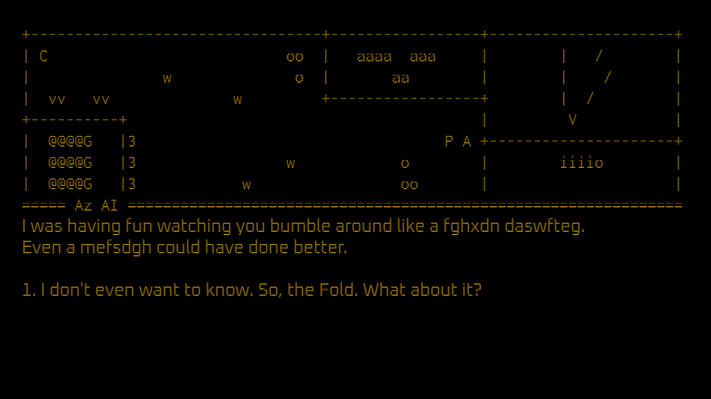

# Possibly Justified

Author: Siddharth Sahay (ssahay2)

Design: Possibly Justified is a retro-inspired story-driven RPG (with "terminal CRT" graphics!). You are a space archaeologist, and in a particularly interesting excavation site you find an irritable AI with a plan to rescue an entire civilization...if you can trust it. 

Unfortunately, the time available far exceeded ambition as usual, and I was only able to implement the mechanics, and only the first third of the game. Currently, the first dialogue with the AI is complete, and the text-graphics work as well as player movement. There were two more dialogue acts planned after this one depending on what you find in each of the rooms.

Text Drawing: 
Text rendering is divided into 16 lines, each being a textured quad. Each line (represented by the Line struct in PlayMode.hpp) uses HarfBuzz and FreeType to render text to a texture whenever its setText() method is called i.e. when the text changes because of a scene change or player movement. Since high framerate isn't needed for this, I'm not sure if this is excruciatingly slow or fast enough, although I suspect the former. The Line struct contains most of the implementation.

Text data (dialog tree) comes from a stylized include file ("dialog.tree") which basically builds a std::map of Nodes (defined in PlayMode.hpp) and node_ids. The RPG map is also defined as a vector of strings in this file. New dialog can be added in without modifying the code, it's just text.

Screen Shot:

How To Play:

The bottom half is the text area, the top half the map. You start with map control disabled. Use the 1, 2, 3, 4 keys to select responses. After you finish speaking to the AI, you can use W, S, A, D to move around the room. "P" represents the player, "C" the information conduit, and "A" the AI terminal. The other symbols would have represented interactable objects in the planned version of the game, currently there is nothing to do after you enter free roam. No exit condition was implemented either.

Sources: 
* Inconsolata font (regular) from https://github.com/google/fonts/tree/main/ofl/inconsolata ([License](dist/OFL.txt))

* Oxanium font (regular) from https://fontlibrary.org/en/font/oxanium ([License](dist/oxanium/LICENSE.txt))

* Game 0 Base Code from https://github.com/15-466/15-466-f21-base0

This game was built with [NEST](NEST.md).

